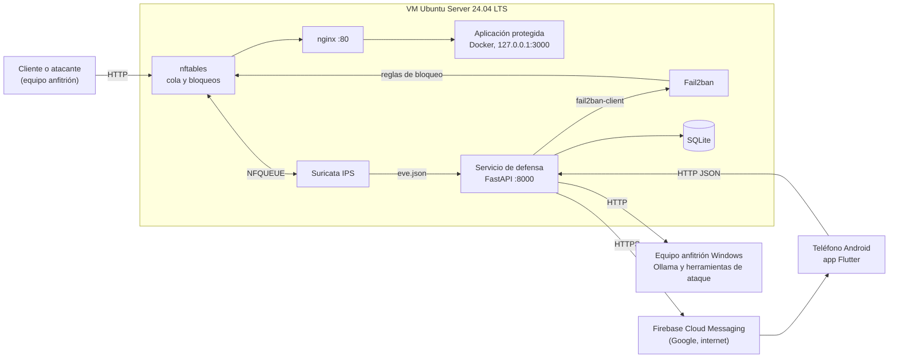

# Cimientos del Sprint 1: arquitectura, proyectos e instrucciones

| Campo | Detalle |
|---|---|
| Proyecto | Plataforma de Defensa Web en Tiempo de Ejecución (Grupo 13, Ingeniería de Software II) |
| Fecha | 19 de septiembre de 2026 |
| Estado | 1.1 Gestión: cerrado. 1.2 Transversal: resuelto en las secciones 2 a 7. 1.3 a 1.11: instrucciones en la sección 8 |

> Las tareas (C-xx) son las del documento *Sprint 1: cimientos, objetivo e historias de usuario*. Donde aparece `<IP_VM>` va la IP de la VM y `<IP_ANFITRION>` la de tu equipo Windows. Todo lo que ataca (sqlmap, Nikto, ffuf, k6) se usa solo contra la VM del laboratorio.

---

## 1. Decisiones de esta ronda

| # | Tema | Decisión |
|---|---|---|
| 1 | Gestión del proyecto (C-01 a C-05) | Cerrada |
| 2 | Integración continua (C-10) | **Pospuesta** hasta definir dónde se despliega. Mientras tanto: formato al guardar, `pre-commit` al hacer commit y pytest local |
| 3 | Despliegue en la nube | No bloquea el Sprint 1. La defensa necesita una VM Linux completa; si se usa AWS, el servicio es **EC2** (o Lightsail). Ver sección 5 |
| 4 | Docker y Docker Compose | Automáticos al guardar con **Compose Watch**. Un `compose.yaml` en la raíz que incluye el de cada proyecto. Ver sección 6 |
| 5 | Instrucciones | Desde 1.3 (C-14 a C-50), en la sección 8 |

---

## 2. Arquitectura: qué se construye y dónde corre cada pieza

Tres aplicaciones propias (servicio de defensa, app móvil, entrenamiento de IA) sobre una capa defensiva hecha con cuatro herramientas existentes (nginx, Suricata, Fail2ban, nftables). El servicio de defensa es el único que conecta todo.



| Pieza | Dónde corre | Cómo se ejecuta |
|---|---|---|
| nginx, Suricata, Fail2ban, nftables | VM Ubuntu | Instalados en el sistema (`apt`), como servicios systemd. **No van en Docker**: necesitan el kernel del host |
| Aplicación protegida | VM Ubuntu | Docker Compose, escuchando solo en `127.0.0.1:3000` |
| Servicio de defensa | Desarrollo: tu Windows, en Docker, modo simulado. Real: la VM | En la VM va como servicio systemd con un usuario dedicado, porque lee `eve.json` y llama a `fail2ban-client` en el host |
| SQLite | Donde corre el servicio | Un archivo, en modo WAL |
| Ollama | Equipo anfitrión Windows | Instalación nativa; el servicio lo consulta por red |
| App móvil | Teléfono Android | En desarrollo `flutter run` con hot reload; para la demostración, una APK |
| Firebase Cloud Messaging | Google | Requiere internet en el servicio y en el teléfono |

---

## 3. Proyectos que vas a crear

Un solo repositorio de Git (monorepo) con cuatro proyectos y dos carpetas de apoyo. Es lo más simple para un equipo de 5 con poco tiempo: un solo flujo de Pull Requests, un solo `compose.yaml` raíz y los cambios entre servicio y móvil viajan juntos. Si más adelante conviene, se separa.

| Proyecto | Qué es | Tecnología | Corre en | ¿Docker? |
|---|---|---|---|---|
| `servicio/` | Servicio de defensa: ingesta, correlación, política, API, panel y notificador | Python, FastAPI, SQLModel, SQLite | Desarrollo: Windows con Docker. Real: VM | Solo en desarrollo |
| `movil/` | Aplicación móvil | Flutter (Dart) | Teléfono Android | No |
| `ia/` | Captura de datos, entrenamiento y evaluación del clasificador. Exporta el modelo | Python, scikit-learn, joblib | Equipo de cada integrante, sin conexión | No |
| `infra/` | Aprovisionamiento de la VM, configuración de nginx, Suricata, Fail2ban y nftables, y el Compose de la aplicación protegida | Bash, Vagrant, Docker Compose | VM | Solo la aplicación protegida |
| `pruebas/` | Scripts de k6, ataques simulados y guion de la demostración | k6, Bash o Python | Equipo anfitrión | No |
| `docs/` | Modelos C4 y UML exportados, DoD, plan de pruebas | Markdown, imágenes | — | No |

```
defensa-web/
├─ compose.yaml                  # raíz: incluye el compose de cada proyecto
├─ Vagrantfile                   # VM reproducible (llama a infra/provision)
├─ .gitignore  .gitattributes  .pre-commit-config.yaml  .env.example
├─ .vscode/settings.json         # formato al guardar y hot reload
├─ servicio/
│  ├─ Dockerfile  compose.yaml  requirements.txt
│  ├─ app/
│  │  ├─ main.py  config.py
│  │  ├─ api/                    # routers: auth, incidentes, baneos, dispositivos, salud
│  │  ├─ dominio/                # modelos SQLModel
│  │  ├─ componentes/            # fuente_eventos, correlador, politicas, actuador,
│  │  │                          # clasificador, informes, notificador, conciliador
│  │  ├─ repositorio.py
│  │  └─ web/                    # plantillas Jinja2 y estáticos locales (Sprint 2)
│  ├─ modelos/                   # clasificador.joblib (lo exporta ia/)
│  └─ tests/
├─ movil/                        # proyecto Flutter
├─ ia/
│  ├─ captura/  entrenamiento/  datos/   # datos/ no se versiona
│  └─ requirements.txt
├─ infra/
│  ├─ compose/app-protegida.yaml
│  ├─ config/{nginx,suricata,fail2ban,nftables}/
│  └─ provision/{provision.sh,00-base.sh,10-docker.sh,...}
├─ pruebas/{k6,ataques,guion.md}
└─ docs/
```

---

## 4. Dos modos de ejecución

| | Simulado | Real |
|---|---|---|
| Dónde | Windows de cada integrante | VM Ubuntu |
| Qué corre | Servicio (`FakeSource`, `DryRunActuator`) y aplicación protegida, en Docker | Toda la capa defensiva, la aplicación protegida y el servicio con `EveSource` y `Fail2banActuator` |
| Para qué | Desarrollar y probar la lógica de las HU sin la VM | Spikes, ataques simulados, métricas y demostración |
| Cómo se activa | `DEFENSA_MODO=simulado` | `DEFENSA_MODO=real` |

Ninguna HU debe depender del modo: cambia solo la implementación detrás de las interfaces `Fuente de eventos` y `Actuador de bloqueo`.

---

## 5. Despliegue en la nube: qué servicio usar

**No hace falta decidirlo para el Sprint 1.** La decisión vigente es la VM local en red bridged, y hay tres razones para mantenerla en esta entrega: la aplicación vulnerable no debe exponerse fuera del laboratorio, el aula puede no tener buena red y la entrega es el 22 de septiembre.

Si quieren desplegar en AWS más adelante, el criterio es uno: la defensa usa la cola de Suricata (NFQUEUE), nftables y Fail2ban, que necesitan **root y el kernel del host**.

| Opción en AWS | ¿Sirve? | Motivo |
|---|---|---|
| **EC2** con Ubuntu 24.04 LTS (2 vCPU y 4 GB de RAM como mínimo, por ejemplo `t3.medium`) | Sí | Es una VM completa: todo funciona igual que en la VM local, y la IP del cliente llega directa |
| **Lightsail** (instancia Linux) | Sí | Lo mismo que EC2 con menos configuración: IP fija, firewall en el panel y precio fijo |
| ECS o Fargate, App Runner, Elastic Beanstalk, Lambda | No | No dan acceso al kernel del host |
| Detrás de un balanceador (ALB), CloudFront o API Gateway | No | Suricata y nftables verían la IP del balanceador o del CDN y bloquearían a todos |

Si se hace, conviene tener en cuenta:

- **Región.** São Paulo (`sa-east-1`) es la más cercana a Bolivia. Verifiquen precios y créditos vigentes en la calculadora de AWS antes de crear nada.
- **Grupo de seguridad.** Puerto 80 solo desde las IP del equipo, porque la aplicación de la demostración es vulnerable a propósito. Puertos 22 y 8000 solo desde la IP de administración. IP elástica.
- **Política de pruebas de AWS.** Se pueden probar los recursos propios (EC2 y Lightsail están permitidos), pero están prohibidos el DoS y el *request flooding*, incluido el de inicio de sesión. La fuerza bruta del plan de pruebas y las pruebas de carga con k6 deben ser moderadas, o hacerse en la VM local.
- **Ventaja.** El teléfono alcanza el servidor por IP pública y el spike 6 se simplifica. El costo es depender de internet en la demostración.
- **Reutilización.** El script de aprovisionamiento (C-07) es el mismo para EC2. Por eso conviene escribirlo como Bash puro, con Vagrant solo como envoltorio.

---

## 6. Docker y Compose: automático al guardar

### 6.1 Cómo funciona

Docker Compose Watch (Compose 2.22 o superior) observa las carpetas que se indiquen y, al guardar un archivo, hace una de tres cosas:

| Acción | Qué hace | Se usa para |
|---|---|---|
| `sync` | Copia el archivo al contenedor que sigue corriendo | Código Python (uvicorn con `--reload` lo recarga) |
| `sync+restart` | Copia y reinicia el proceso | Archivos de configuración |
| `rebuild` | Reconstruye la imagen y recrea el contenedor | `requirements.txt`, `Dockerfile` |

En Windows funciona mejor que un volumen montado, porque las notificaciones de cambio en carpetas compartidas no son fiables.

### 6.2 Archivos

`compose.yaml` (raíz). El elemento `include` (Compose 2.20.3 o superior) carga cada proyecto con su propia carpeta base, así las rutas relativas de cada uno siguen funcionando:

```yaml
name: defensa-web
include:
  - path: infra/compose/app-protegida.yaml
  - path: servicio/compose.yaml
```

`infra/compose/app-protegida.yaml`:

```yaml
services:
  app-protegida:
    image: bkimminich/juice-shop        # propuesta; se confirma en C-11
    ports:
      - "127.0.0.1:3000:3000"           # solo loopback: nunca expuesta por fuera del proxy
    restart: unless-stopped             # arranca sola con la VM
```

`servicio/compose.yaml`:

```yaml
services:
  servicio:
    build: .
    ports:
      - "8000:8000"
    environment:
      DEFENSA_MODO: simulado
      DEFENSA_DB: /datos/defensa.db
      DEFENSA_OLLAMA_URL: http://host.docker.internal:11434
    volumes:
      - datos-servicio:/datos
    develop:
      watch:
        - action: sync
          path: ./app
          target: /app/app
          ignore:
            - __pycache__/
        - action: rebuild
          path: ./requirements.txt
volumes:
  datos-servicio:
```

`servicio/Dockerfile` (solo desarrollo; en la VM el servicio va en systemd):

```dockerfile
FROM python:3.12-slim
ENV PYTHONUNBUFFERED=1
WORKDIR /app
COPY requirements.txt .
RUN pip install --no-cache-dir -r requirements.txt
COPY app ./app
CMD ["uvicorn", "app.main:app", "--host", "0.0.0.0", "--port", "8000", "--reload", "--reload-dir", "app"]
```

### 6.3 Uso

```bash
docker compose watch          # desde la raíz: levanta todo y observa los cambios
docker compose config         # comprueba que el include resolvió bien las rutas
docker compose down           # apaga todo
```

Guardas un `.py` de `servicio/app/`, Compose lo copia y uvicorn recarga. Cambias `requirements.txt` y reconstruye solo. Si añaden otro proyecto con Docker, se agrega una línea a `include`.

### 6.4 Lo que no es Docker también se actualiza al guardar

| Componente | Cómo se actualiza al guardar |
|---|---|
| `servicio` en desarrollo | Compose Watch, como arriba |
| `servicio` en la VM | Editar por **VS Code Remote-SSH** directamente en la VM con `uvicorn --reload`. En la demostración, systemd |
| `movil` | Hot reload al guardar (ajuste `dart.hotReloadOnSave` de VS Code, en `.vscode/settings.json`) |
| Python y Dart | Formato al guardar (`formatOnSave`) |
| Configuración de nginx, Suricata y Fail2ban | No se recarga sola. *Propuesta*: `entr` en la VM: `ls infra/config/*/* \| entr -r ./infra/provision/aplicar-config.sh`, con un script que copia, valida (`nginx -t`, `suricata -T`, `fail2ban-client -t`) y recarga |

---

## 7. Transversal (1.2) resuelto: C-06 a C-13

### C-06 · VM Ubuntu Server 24.04 LTS

1. Descarga la ISO de Ubuntu Server 24.04 LTS y VirtualBox 7.x. Si VirtualBox se queja de la virtualización en Windows, es el conflicto con Hyper-V o WSL2: la versión 7 funciona con ese modo, aunque más lento.
2. Crea la VM con 2 CPU, 4096 MB de RAM y un disco de 25 GB. **Adaptador 1: Adaptador puente** sobre tu interfaz real (Wi-Fi o Ethernet). Nunca NAT para el tráfico de ataque.
3. Instala con nombre `defensa`, usuario `ops` y marca *Install OpenSSH server*.
4. Deshabilita IPv6:

```bash
sudo tee /etc/sysctl.d/99-sin-ipv6.conf <<'EOF'
net.ipv6.conf.all.disable_ipv6 = 1
net.ipv6.conf.default.disable_ipv6 = 1
EOF
sudo sysctl --system
```

5. Actualiza e instala utilidades:

```bash
sudo apt update && sudo apt -y full-upgrade
sudo apt install -y curl jq git ethtool sqlite3 acl
```

6. Toma un snapshot llamado `base-limpia`.

**Verifica:** `ip -4 -br a` muestra una IP de tu red; `ssh ops@<IP_VM>` funciona desde Windows; `ip -6 a` no muestra direcciones globales.

**Ojo:** si la red del aula aísla a los clientes entre sí, ni el anfitrión ni el teléfono alcanzarán la VM. Eso lo decide el spike 6 (C-44); las alternativas son el punto de acceso del portátil o un router propio.

### C-07 · Script de aprovisionamiento

1. Un script por componente, numerados y repetibles (que se puedan ejecutar dos veces sin romper nada), en `infra/provision/`: `00-base.sh`, `10-docker.sh`, `20-app.sh`, `30-nginx.sh`, `40-suricata.sh`, `50-nftables.sh`, `60-fail2ban.sh`, `70-usuario-servicio.sh`. Cada tarea C-14 a C-22 agrega su parte.
2. `provision.sh` los ejecuta en orden:

```bash
#!/usr/bin/env bash
set -euo pipefail
cd "$(dirname "$0")"
for f in [0-9][0-9]-*.sh; do
  echo "==> $f"
  bash "$f"
done
```

3. La configuración vive en `infra/config/` y los scripts la copian con `sudo install -m 644 origen destino`.
4. `Vagrantfile` en la raíz, solo como envoltorio (`/vagrant` es la raíz del repositorio dentro de la VM). Verifica que exista una box de Ubuntu 24.04 para tu proveedor; `bento/ubuntu-24.04` es una candidata:

```ruby
Vagrant.configure("2") do |config|
  config.vm.box = "bento/ubuntu-24.04"
  config.vm.hostname = "defensa"
  config.vm.network "public_network"          # puente
  config.vm.provider "virtualbox" do |vb|
    vb.cpus = 2
    vb.memory = 4096
  end
  config.vm.provision "shell", path: "infra/provision/provision.sh"
end
```

**Verifica:** `vagrant destroy -f && vagrant up` deja una VM equivalente sin pasos manuales, y otro integrante obtiene el mismo resultado.

### C-08 · Repositorio en GitHub

```bash
git init defensa-web && cd defensa-web
git branch -M main
git remote add origin https://github.com/<organizacion>/defensa-web.git
```

1. **`.gitattributes`** (imprescindible con Windows: un `.sh` con fin de línea CRLF falla en la VM):

```
* text=auto
*.sh text eol=lf
*.yaml text eol=lf
*.yml text eol=lf
Vagrantfile text eol=lf
```

2. **`.gitignore`** con lo mínimo: `.env`, `secrets/`, `*.db`, `*.db-wal`, `*.db-shm`, `ia/datos/`, `__pycache__/`, `.venv/`, `.dart_tool/`, `build/`, `movil/android/app/google-services.json` y `.vagrant/`. Se versiona `.env.example` con nombres de variables sin valores.
3. **Protección de `main`:** en GitHub, Settings, Rules (o Branches), exige Pull Request y una aprobación, y bloquea el push directo y el forzado. Si el repositorio es privado y la cuenta gratuita, esa opción puede requerir GitHub Pro (gratis con el Student Developer Pack); verifícalo en tu cuenta.
4. **Ramas y commits:** `feature/pb-2-deteccion-sqli`; commits convencionales (`feat(servicio): ...`, `fix`, `docs`, `test`, `chore`).
5. **Hooks locales** (*propuesta*, reemplazan a la integración continua por ahora): `pip install pre-commit`, crear `.pre-commit-config.yaml` y ejecutar `pre-commit install`. Reemplaza cada `rev` por la última etiqueta con `pre-commit autoupdate`:

```yaml
repos:
  - repo: https://github.com/astral-sh/ruff-pre-commit
    rev: v0.8.0
    hooks:
      - id: ruff
        args: [--fix]
      - id: ruff-format      # propuesta: reemplaza a black, con el mismo formato
  - repo: https://github.com/gitleaks/gitleaks
    rev: v8.21.2
    hooks:
      - id: gitleaks         # bloquea commits con claves o tokens
```

6. **`.vscode/settings.json`** compartido:

```json
{
  "[python]": { "editor.defaultFormatter": "charliermarsh.ruff", "editor.formatOnSave": true },
  "[dart]": { "editor.formatOnSave": true },
  "dart.hotReloadOnSave": "all"
}
```

**Verifica:** un push directo a `main` es rechazado; un commit con un texto tipo clave falso lo bloquea `gitleaks`.

### C-09 · Estructura del repositorio

Crea las carpetas del árbol de la sección 3, cada una con un `README.md` de una línea que diga qué contiene y cómo se ejecuta.

### C-10 · Integración continua: pospuesta

Sin destino de despliegue definido no aporta todavía. Lo que la reemplaza: formato al guardar, `pre-commit` y `pytest` (y `flutter analyze` con `flutter test`) ejecutados a mano antes de abrir un Pull Request. Cuando se defina el despliegue, se reactiva con un flujo que ejecute lo mismo en cada Pull Request.

### C-11 · Elegir la aplicación de la demostración

Prueba de 30 minutos con Juice Shop (finalista por defecto). En cualquier equipo con Docker:

```bash
docker run -d --name juice -p 127.0.0.1:3000:3000 bkimminich/juice-shop

# (2) tiene login: debe responder 401 con credenciales malas
curl -s -o /dev/null -w "%{http_code}\n" -X POST http://127.0.0.1:3000/rest/user/login \
  -H 'Content-Type: application/json' -d '{"email":"x@x.com","password":"mal"}'

# (3) parámetro GET de búsqueda: debe devolver datos
curl -s "http://127.0.0.1:3000/rest/products/search?q=apple" | jq '.data | length'

# (4) consumo de RAM
docker stats --no-stream juice

# (5) reinicio a estado limpio: medir hasta que responda
docker rm -f juice
time (docker run -d --name juice -p 127.0.0.1:3000:3000 bkimminich/juice-shop >/dev/null \
  && until curl -sf http://127.0.0.1:3000 >/dev/null; do sleep 1; done)
```

La comprobación (1), que responde por HTTP desde el portátil, se hace en C-14. Registra los cinco resultados en `docs/decision-app-demo.md`. Si Juice Shop cumple, queda elegida; una segunda aplicación realista (WooCommerce u OpenCart) se evalúa solo si hay tiempo.

### C-12 · Aplicación protegida con Docker Compose

1. En la VM instala Docker desde los paquetes de Ubuntu y da permisos a tu usuario:

```bash
sudo apt install -y docker.io docker-compose-v2
sudo usermod -aG docker $USER      # cierra sesión y vuelve a entrar
```

2. Usa el archivo `infra/compose/app-protegida.yaml` de la sección 6.2.
3. Levántala: `docker compose -f infra/compose/app-protegida.yaml up -d`.

**Verifica:**
- En la VM, `curl -I http://127.0.0.1:3000` responde.
- `sudo ss -tlnp | grep 3000` muestra `127.0.0.1:3000` y no `0.0.0.0`.
- Desde Windows, `curl http://<IP_VM>:3000` es rechazado.
- `docker compose ... down && ... up -d` la deja limpia en menos de un minuto.

En Windows (Docker Desktop) el flujo automático es el de la sección 6: `docker compose watch` en la raíz.

### C-13 · Herramientas de ataque en el equipo anfitrión

Recomendado: **WSL2 con Ubuntu** para las herramientas de línea de comandos y k6 nativo en Windows.

```bash
# En WSL2 (Ubuntu)
sudo apt update
sudo apt install -y sqlmap nikto ffuf dirb curl jq
#   diccionario para ffuf: /usr/share/dirb/wordlists/common.txt
```

```powershell
# En Windows (PowerShell)
winget install k6 --source winget
```

OWASP ZAP: instalador desde zaproxy.org. Verifica cada herramienta con `--version`.

**Verifica:** desde WSL2, `curl -A prueba http://<IP_VM>/` y en la VM `sudo tail /var/log/nginx/access.log` (después de C-14). WSL2 sale por NAT, así que la VM verá la IP de tu Windows como origen; es la IP que se bloqueará en las pruebas.

---

## 8. Instrucciones de 1.3 en adelante (C-14 a C-50)

Salvo que se indique otra cosa, los comandos se ejecutan en la VM y cada paso se agrega al script de aprovisionamiento correspondiente (C-07).

### 8.1 M1. Enrutamiento

#### C-14 · nginx como proxy inverso (Modo A)

```bash
sudo apt install -y nginx
sudo rm -f /etc/nginx/sites-enabled/default
sudo tee /etc/nginx/conf.d/defensa.conf <<'EOF'
server {
    listen 80 default_server;
    server_name _;

    access_log /var/log/nginx/access.log;
    error_log  /var/log/nginx/error.log;

    location / {
        proxy_pass http://127.0.0.1:3000;
        proxy_set_header Host              $host;
        proxy_set_header X-Real-IP         $remote_addr;
        proxy_set_header X-Forwarded-For   $proxy_add_x_forwarded_for;
        proxy_set_header X-Forwarded-Proto $scheme;
    }
}
EOF
sudo nginx -t && sudo systemctl reload nginx
```

**Verifica:** desde Windows `curl -I http://<IP_VM>/` da 200 y `curl http://<IP_VM>:3000` es rechazado. Deja UFW deshabilitado: las reglas las gestionan nftables y Fail2ban.

#### C-15 · IP real del cliente

Sin proxy ni CDN delante, `$remote_addr` ya es la IP real y **no se debe confiar en `X-Forwarded-For`**. La configuración solo se activa si hay un proxy de confianza delante. Déjala comentada en `defensa.conf`:

```nginx
# Solo si hay un proxy de confianza delante (CDN o balanceador):
# set_real_ip_from 10.0.0.0/8;
# real_ip_header   X-Forwarded-For;
# real_ip_recursive on;
```

**Verifica:** `curl -H "X-Forwarded-For: 1.2.3.4" http://<IP_VM>/` y en `access.log` debe figurar la IP de tu equipo, no `1.2.3.4`. Es una prueba de seguridad: si el servicio confiara en esa cabecera, un atacante podría hacer bloquear IP ajenas.

### 8.2 M2. Inspección y bloqueo en línea

#### C-16 · Suricata en modo IDS

```bash
sudo add-apt-repository -y ppa:oisf/suricata-stable
sudo apt update && sudo apt install -y suricata
suricata --build-info | grep -i nfq        # debe decir: NFQueue: yes
ip -br a                                    # anota el nombre de la interfaz, por ejemplo enp0s3
```

Edita `/etc/suricata/suricata.yaml`:

- `vars.address-groups.HOME_NET: "[<IP_VM>/32]"`. **Solo la VM.** Con el valor por defecto (rangos privados), tu equipo atacante también cae dentro de `HOME_NET`, `EXTERNAL_NET` queda como "todo lo demás" y las reglas de Emerging Threats, que buscan tráfico `EXTERNAL_NET` hacia `HOME_NET`, no disparan.
- En `af-packet:`, `interface:` con el nombre real de la interfaz (y, si el paquete usa `/etc/default/suricata`, el mismo valor en `IFACE`).

```bash
sudo suricata -T -c /etc/suricata/suricata.yaml -v      # debe terminar sin errores
sudo systemctl enable --now suricata
sudo journalctl -u suricata -n 20 --no-pager             # confirma que arrancó capturando
```

Si no aparece ninguna alerta con un ataque conocido, revisa el *offloading* de checksums de la VM: `sudo ethtool -K <interfaz> rx off tx off`.

#### C-17 · Reglas y modo sin conexión

```bash
sudo suricata-update update-sources
sudo suricata-update list-sources          # confirma que et/open está disponible
sudo suricata-update                       # descarga y genera /var/lib/suricata/rules/suricata.rules
```

Añade tu archivo de reglas propias en `suricata.yaml`, en `rule-files:`:

```yaml
rule-files:
  - suricata.rules
  - /etc/suricata/rules/local.rules
```

```bash
sudo mkdir -p /etc/suricata/rules
echo '# reglas propias (sid desde 1000000)' | sudo tee /etc/suricata/rules/local.rules
sudo suricata -T -c /etc/suricata/suricata.yaml -v
```

Primero mide con el conjunto completo: `free -m` y `systemctl status suricata` (ver memoria). Si con 4 GB va justo, deja solo categorías web. `suricata-update` aplica primero `disable.conf` y luego `enable.conf`, así que se puede desactivar todo y volver a activar lo que interesa:

```
# /etc/suricata/disable.conf
re:.
```

```
# /etc/suricata/enable.conf
group:emerging-web_server.rules
group:emerging-web_specific_apps.rules
group:emerging-sql.rules
group:emerging-scan.rules
group:emerging-exploit.rules
group:emerging-info.rules
group:emerging-user_agents.rules
```

```bash
sudo suricata-update
grep -c '^alert' /var/lib/suricata/rules/suricata.rules     # cuántas reglas quedaron
```

**Para operar sin internet:** ejecuta `suricata-update` una vez con conexión. Después, cuando cambies `disable.conf`, `enable.conf` o `drop.conf`, usa `sudo suricata-update --offline`, que regenera con las reglas en caché. Recarga sin reiniciar con `sudo suricatasc -c ruleset-reload-nonblocking`.

**Verifica:** desconecta la VM de internet, reinicia Suricata y comprueba que arranca (`systemctl status suricata`).

#### C-18 · `eve.json` y su rotación

En `suricata.yaml`, dentro de `outputs:`, deja en `eve-log` solo lo que se usa:

```yaml
outputs:
  - eve-log:
      enabled: yes
      filetype: regular
      filename: eve.json
      types:
        - alert:
            metadata: yes
            payload: no          # Pb-20 puede necesitar un fragmento del cuerpo; se decide allí
        - stats:
            totals: yes
            threads: no
```

Activa el latido con `stats:` en el nivel superior: `enabled: yes` e `interval: 30`.

**Prueba con una regla propia:**

```bash
echo 'alert http any any -> any any (msg:"DEFENSA prueba"; http.uri; content:"/prueba-suricata"; sid:1000000; rev:1;)' \
  | sudo tee -a /etc/suricata/rules/local.rules
sudo suricatasc -c ruleset-reload-nonblocking
curl -s -o /dev/null http://<IP_VM>/prueba-suricata
sudo jq -c 'select(.event_type=="alert") | {timestamp, src_ip, sig:.alert.signature, sev:.alert.severity, cat:.alert.category, met:.http.http_method, url:.http.url}' \
  /var/log/suricata/eve.json | tail -n 3
```

Debe verse la alerta con fecha, IP, firma, severidad, categoría, método y URL.

**Rotación:** el paquete instala `/etc/logrotate.d/suricata`. Compruébala con `sudo logrotate -f /etc/logrotate.d/suricata` y `ls -l /var/log/suricata/`: debe haber un `eve.json` nuevo y Suricata debe seguir escribiendo en él.

#### C-19 · nftables con la cola de Suricata (Modo A)

Ubuntu carga `/etc/nftables.conf`, que trae `flush ruleset`. Eso borra las reglas de Fail2ban y de Docker cada vez que se recarga el servicio, así que se reemplaza por un archivo que no toca las tablas ajenas:

```bash
sudo mkdir -p /etc/nftables.d
sudo tee /etc/nftables.conf <<'EOF'
#!/usr/sbin/nft -f
include "/etc/nftables.d/*.nft"
EOF

sudo tee /etc/nftables.d/defensa.nft <<'EOF'
table inet defensa
delete table inet defensa
table inet defensa {
    chain entrada {
        type filter hook input priority 0; policy accept;
        tcp dport 80 queue flags bypass to 0
    }
    chain salida {
        type filter hook output priority 0; policy accept;
        tcp sport 80 queue flags bypass to 0
    }
}
EOF
sudo nft -f /etc/nftables.d/defensa.nft
sudo systemctl enable nftables
```

`table ... / delete table ... / table ...` es la forma de que el archivo se pueda cargar varias veces sin duplicar reglas. La opción `bypass` hace que, si Suricata no está escuchando la cola, el kernel acepte los paquetes: es el fail-open. Si tu versión de `nft` rechaza la sintaxis, la equivalente es `queue num 0 options bypass` (la que usa la documentación de Suricata).

**Verifica:** `sudo nft list ruleset` muestra la tabla `inet defensa` con las dos reglas y `curl http://<IP_VM>/` sigue respondiendo (Suricata aún corre en IDS, sin leer la cola, y por eso pasa por *bypass*).

### 8.3 M3. Respuesta por dirección

#### C-20 · Fail2ban con nftables

```bash
sudo apt install -y fail2ban
sudo tee /etc/fail2ban/filter.d/defensa-web.conf <<'EOF'
[Definition]
# Marcador: los baneos del MVP los ordena el servicio con "banip".
# Pb-17 (fuerza bruta) sustituirá esta expresión por la del login fallido.
failregex = ^<HOST> .* "DEFENSA-MARCADOR
ignoreregex =
EOF

sudo tee /etc/fail2ban/jail.d/defensa.local <<'EOF'
[DEFAULT]
ignoreip = 127.0.0.0/8 <RED_ADMIN>/24 <GATEWAY>

[defensa-web]
enabled   = true
filter    = defensa-web
logpath   = /var/log/nginx/access.log
backend   = auto
maxretry  = 5
findtime  = 60
bantime   = 10m
banaction = nftables[type=allports]
EOF
sudo fail2ban-client -t && sudo systemctl restart fail2ban
```

Sustituye `<RED_ADMIN>` y `<GATEWAY>` (gateway: `ip route | awk '/default/ {print $3}'`).

**Verifica:**

```bash
sudo fail2ban-client set defensa-web banip 192.0.2.10
sudo nft list ruleset | grep -B3 -A6 defensa-web      # la IP aparece en el set de f2b-table
sudo nft list chain inet f2b-table f2b-chain          # prioridad -1: se evalúa antes que la cola (prioridad 0)
sudo fail2ban-client set defensa-web unbanip 192.0.2.10
```

La prioridad de la cadena de Fail2ban es menor que la de la cola de Suricata, así que una IP bloqueada se corta antes de llegar a la inspección.

#### C-21 · Usuario del servicio y `sudoers`

```bash
sudo adduser --system --group --home /opt/defensa --shell /usr/sbin/nologin defensa

sudo visudo -f /etc/sudoers.d/defensa
# contenido, en una sola línea:
# defensa ALL=(root) NOPASSWD: /usr/bin/fail2ban-client set defensa-web banip *, /usr/bin/fail2ban-client set defensa-web unbanip *, /usr/bin/fail2ban-client status defensa-web
sudo chmod 440 /etc/sudoers.d/defensa && sudo visudo -c

# lectura de eve.json, incluso después de rotar
sudo setfacl -R -m u:defensa:rX /var/log/suricata
sudo setfacl -d -m u:defensa:rX /var/log/suricata
```

**Verifica:**

```bash
sudo -u defensa sudo -n fail2ban-client set defensa-web banip 192.0.2.11     # funciona
sudo -u defensa sudo -n cat /etc/shadow                                       # debe fallar
sudo -u defensa cat /var/log/suricata/eve.json | head -n 1                    # funciona
```

El `*` del `sudoers` admite cualquier argumento final, así que **el servicio debe validar la IP con `ipaddress` antes de llamar** (Pb-6, Pb-28).

#### C-22 · Lista blanca y puerto de gestión

1. Define los tres rangos (loopback `127.0.0.0/8`, red de administración y gateway) en `ignoreip` (C-20) y en el `.env` del servicio, por ejemplo `DEFENSA_LISTA_BLANCA=127.0.0.0/8,192.168.1.0/24,192.168.1.1`.
2. Restringe el puerto 8000 a la red de administración, dentro del mismo `defensa.nft`:

```
    chain gestion {
        type filter hook input priority -10; policy accept;
        tcp dport 8000 ip saddr != 192.168.1.0/24 drop
    }
```

3. Prueba el comportamiento de `banip` con una IP de la lista (`fail2ban-client set defensa-web banip 127.0.0.1`) y anótalo. **No dependas de `ignoreip` para los baneos manuales**: el servicio debe rechazar la IP por su cuenta (criterio de Pb-6).

### 8.4 M4. Correlación y persistencia (base del backend)

#### C-23 · Esqueleto del servicio FastAPI

`servicio/requirements.txt` (fija las versiones con `pip freeze` una vez que funcione; **`scikit-learn` debe ser exactamente la misma versión que en `ia/`**, porque un modelo de joblib guardado con otra versión puede fallar al cargar):

```
fastapi
uvicorn[standard]
sqlmodel
pydantic-settings
scikit-learn
joblib
firebase-admin
httpx
pytest
ruff
```

`servicio/app/main.py`:

```python
from contextlib import asynccontextmanager
from fastapi import FastAPI

@asynccontextmanager
async def lifespan(app: FastAPI):
    # aquí se arrancarán las tareas de fondo (lectura de eventos, conciliador)
    yield

app = FastAPI(title="Defensa Web", lifespan=lifespan)

@app.get("/api/ping")
def ping():
    return {"ok": True}
```

Crea las carpetas y archivos vacíos de `componentes/` del árbol de la sección 3 (un módulo por componente del C4 nivel 3).

**Verifica:** `docker compose watch` en la raíz y `curl http://localhost:8000/api/ping` devuelve `{"ok":true}`; al cambiar el texto de la respuesta y guardar, el cambio se ve sin reiniciar nada.

#### C-24 · Configuración centralizada

*Propuesta:* `pydantic-settings`, que lee variables de entorno y `.env` con tipos validados (es la librería que recomienda FastAPI):

```python
from typing import Literal
from pydantic_settings import BaseSettings, SettingsConfigDict

class Ajustes(BaseSettings):
    model_config = SettingsConfigDict(env_prefix="DEFENSA_", env_file=".env")

    modo: Literal["simulado", "real"] = "simulado"
    db: str = "data/defensa.db"
    eve_json: str = "/var/log/suricata/eve.json"
    umbral_eventos: int = 5
    ventana_seg: int = 60
    ban_minutos: int = 10
    ventana_incidente_min: int = 5
    lista_blanca: str = "127.0.0.0/8"
    ollama_url: str = "http://localhost:11434"
    fcm_credenciales: str | None = None     # ruta al JSON, fuera del repositorio

ajustes = Ajustes()
```

**Verifica:** `DEFENSA_MODO=real` cambia `ajustes.modo` sin tocar código.

#### C-25 · Interfaces y versiones simuladas

Con `Protocol` y la inyección de dependencias de FastAPI (`Depends`), el resto del código no sabe si es real o simulado:

```python
from typing import Iterator, Protocol

class FuenteEventos(Protocol):
    def leer(self) -> Iterator[dict]: ...

class ActuadorBloqueo(Protocol):
    def banear(self, ip: str, minutos: int) -> bool: ...
    def liberar(self, ip: str) -> bool: ...

class FakeSource:
    """Emite eventos de ejemplo para desarrollar sin la VM."""
    def leer(self) -> Iterator[dict]:
        for i in range(10):
            yield {"ip_origen": "192.0.2.50", "sid": 1000000, "firma": "SQLi de prueba",
                   "categoria": "web-application-attack", "severidad": 1, "url": f"/x?{i}"}

class DryRunActuator:
    """Solo registra; nunca toca el firewall."""
    def banear(self, ip: str, minutos: int) -> bool:
        print(f"[dry-run] banear {ip} {minutos} min"); return True
    def liberar(self, ip: str) -> bool:
        print(f"[dry-run] liberar {ip}"); return True

def obtener_fuente(ajustes) -> FuenteEventos:
    return FakeSource() if ajustes.modo == "simulado" else EveSource(ajustes.eve_json)   # EveSource: Pb-2
```

**Verifica:** en Windows, con el modo simulado, el servicio arranca completo y `DryRunActuator` escribe en el log.

#### C-26 · Modelo de datos (SQLModel y SQLite en WAL)

```python
from datetime import datetime, timezone
from sqlmodel import Field, Relationship, SQLModel, create_engine
from sqlalchemy import event

def ahora() -> datetime:
    return datetime.now(timezone.utc)

class Incidente(SQLModel, table=True):
    id: int | None = Field(default=None, primary_key=True)
    ip_origen: str = Field(index=True)
    tipo_ataque: str
    severidad: str                       # baja | media | alta
    estado: str = "abierto"              # abierto | cerrado
    inicio: datetime = Field(default_factory=ahora)
    ultima_actividad: datetime = Field(default_factory=ahora)
    categoria_owasp: str | None = None
    informe: str | None = None
    origen_informe: str | None = None    # plantilla | generado_ia
    eventos: list["Evento"] = Relationship(back_populates="incidente")
    baneos: list["Baneo"] = Relationship(back_populates="incidente")

class Evento(SQLModel, table=True):
    id: int | None = Field(default=None, primary_key=True)
    fecha_utc: datetime = Field(index=True)
    ip_origen: str = Field(index=True)
    sid: int
    firma: str
    categoria: str
    severidad_firma: int                 # 1 alta, 2 media, 3 baja
    metodo: str | None = None
    url: str | None = None
    incidente_id: int | None = Field(default=None, foreign_key="incidente.id")
    incidente: Incidente | None = Relationship(back_populates="eventos")

class Baneo(SQLModel, table=True):
    id: int | None = Field(default=None, primary_key=True)
    ip: str = Field(index=True)
    inicio: datetime = Field(default_factory=ahora)
    expira: datetime
    nivel_reincidencia: int = 0
    estado: str = "vigente"              # vigente | expirado | liberado | fallido
    incidente_id: int | None = Field(default=None, foreign_key="incidente.id")
    incidente: Incidente | None = Relationship(back_populates="baneos")

class ListaBlanca(SQLModel, table=True):
    id: int | None = Field(default=None, primary_key=True)
    ip_o_red: str
    descripcion: str | None = None

class Dispositivo(SQLModel, table=True):
    id: int | None = Field(default=None, primary_key=True)
    token_fcm: str = Field(unique=True)
    plataforma: str
    alta: datetime = Field(default_factory=ahora)
    actualizado_en: datetime = Field(default_factory=ahora)

class Auditoria(SQLModel, table=True):
    id: int | None = Field(default=None, primary_key=True)
    fecha_utc: datetime = Field(default_factory=ahora)
    actor: str                            # nombre, o "sistema" si lo decidió la política
    accion: str
    ip_afectada: str | None = None
    detalle: str | None = None

class Usuario(SQLModel, table=True):
    id: int | None = Field(default=None, primary_key=True)
    nombre: str = Field(unique=True)
    hash_contrasena: str

engine = create_engine("sqlite:///data/defensa.db", connect_args={"check_same_thread": False})

@event.listens_for(engine, "connect")
def _pragmas(conexion, _):
    cur = conexion.cursor()
    cur.execute("PRAGMA journal_mode=WAL")
    cur.execute("PRAGMA synchronous=NORMAL")
    cur.execute("PRAGMA busy_timeout=5000")
    cur.close()

def crear_tablas():
    SQLModel.metadata.create_all(engine)
```

> **Nota:** este bloque es el borrador ilustrativo de C-26, previo al cierre del modelo de datos. **`Modelo_datos.md` es la fuente de verdad** para el esquema real (tipos, columnas y nombres definitivos: p. ej. `Auditoria.actor` en vez de `usuario`, `Incidente.severidad` como entero, `categoria_owasp` derivada en vez de columna almacenada según ese documento). Ante cualquier diferencia entre este ejemplo y `Modelo_datos.md`, prevalece `Modelo_datos.md`.

Las fechas se guardan en UTC y se convierten al mostrarlas. *Propuesta:* cuando el esquema cambie entre sprints, usar Alembic para migrar sin perder datos; para el Sprint 1 basta con `create_all`.

**Verifica:** `crear_tablas()` genera las siete tablas y `sqlite3 data/defensa.db "PRAGMA journal_mode;"` responde `wal`.

#### C-27 · Repositorio y concurrencia

Una clase `Repositorio` con sesiones cortas (abrir, escribir, cerrar) y métodos por caso de uso (`guardar_evento`, `incidente_abierto(ip, categoria)`, `baneos_vigentes()`). Prueba de concurrencia en `tests/`:

```python
from concurrent.futures import ThreadPoolExecutor

def test_escrituras_concurrentes(repo):
    def escribir(i):
        repo.guardar_evento({"ip_origen": "192.0.2.1", "sid": i, "firma": "x",
                             "categoria": "c", "severidad_firma": 1})
    with ThreadPoolExecutor(max_workers=8) as pool:
        list(pool.map(escribir, range(200)))
    assert repo.contar_eventos() == 200
```

**Verifica:** la prueba termina sin el error `database is locked`.

#### C-28 · Pruebas base

`servicio/tests/test_ping.py`:

```python
from fastapi.testclient import TestClient
from app.main import app

def test_ping():
    assert TestClient(app).get("/api/ping").json() == {"ok": True}
```

Un `conftest.py` con fixtures que inyecten `FakeSource`, `DryRunActuator` y una base SQLite en memoria o temporal.

**Verifica:** `pytest` desde `servicio/` (o `docker compose exec servicio pytest`) pasa en verde.

### 8.5 M5. IA local (datos y entorno)

#### C-29 · Conjunto HTTP CSIC 2010

> **Decisión 2026-09-19:** no se incorpora CSIC 2010 porque la fuente original no está accesible y
> los catálogos/espejos no aportan una licencia del titular con términos suficientes. Se adopta
> captura propia de laboratorio. Evidencia y condiciones de revisión en `docs/datos-ia.md`.

1. Búscalo en su fuente original (Instituto de Seguridad de la Información, CSIC) y verifica la licencia y las condiciones de citación en esa página. Si solo aparece en espejos (Kaggle, GitHub), registra de cuál lo descargas.
2. Guárdalo en `ia/datos/` (no se versiona) y anota en `docs/datos-ia.md`: origen, fecha, licencia y cómo citarlo.
3. Si no está disponible o su licencia no lo permite, decide la alternativa: solo tráfico propio del laboratorio.

#### C-30 · Esquema de datos etiquetados y captura propia

1. Esquema en CSV, una fila por petición: `metodo, uri_decodificada, parametros, cuerpo_fragmento, user_agent, categoria_firma, etiqueta`. Etiquetas: `benigno, sqli, xss, traversal, escaneo, fuerza_bruta`. `indeterminado` es una salida del modelo, no una etiqueta de entrenamiento.
2. **Captura por ventanas etiquetadas:** ejecuta una sola herramienta a la vez, anota la hora de inicio y fin, y etiqueta todo lo que llegó a `eve.json` y `access.log` en esa ventana con la clase de la herramienta:

| Ventana | Herramienta | Etiqueta |
|---|---|---|
| Navegación legítima | Navegador y k6 sobre rutas normales | `benigno` |
| Inyección SQL | sqlmap | `sqli` |
| Escaneo de rutas | Nikto y ffuf | `escaneo` |
| XSS y path traversal | `curl` con payloads y ZAP | `xss`, `traversal` |

3. Script `ia/captura/etiquetar.py` que recibe archivo, hora de inicio y fin, y etiqueta, y añade filas al CSV.

**Verifica:** el script genera un CSV de muestra con al menos una fila por clase.

#### C-31 · Entorno de entrenamiento reproducible

`ia/requirements.txt` con las **mismas versiones fijadas** que `servicio/` para `scikit-learn` y `joblib`, más `pandas` y `matplotlib`.

```python
# ia/entrenamiento/entrenar.py (esqueleto)
import joblib, pandas as pd
from sklearn.feature_extraction.text import TfidfVectorizer
from sklearn.linear_model import LogisticRegression
from sklearn.model_selection import train_test_split
from sklearn.pipeline import make_pipeline

df = pd.read_csv("ia/datos/etiquetado.csv")
texto = (df.metodo + " " + df.uri_decodificada + " " + df.parametros.fillna("")
         + " " + df.cuerpo_fragmento.fillna("") + " " + df.user_agent.fillna(""))
X_tr, X_te, y_tr, y_te = train_test_split(texto, df.etiqueta, test_size=0.2,
                                          stratify=df.etiqueta, random_state=42)
modelo = make_pipeline(TfidfVectorizer(analyzer="char_wb", ngram_range=(3, 5)),
                       LogisticRegression(max_iter=1000))
modelo.fit(X_tr, y_tr)
joblib.dump(modelo, "servicio/modelos/clasificador.joblib")
```

**Verifica:** el script entrena con una muestra pequeña, exporta el modelo y el servicio lo carga con `joblib.load` sin conexión a internet. La evaluación completa (precisión, exhaustividad y matriz de confusión) es parte de Pb-20.

#### C-32 · Ollama (no bloquea el Sprint 1)

1. Instala Ollama en Windows desde ollama.com y descarga un modelo pequeño de los de 1 a 3 B de parámetros (por ejemplo `ollama pull llama3.2:1b`, o uno más grande si la máquina de la demostración lo aguanta).
2. Para que la VM lo alcance, define la variable de entorno de Windows `OLLAMA_HOST=0.0.0.0:11434`, reinicia Ollama y permite el puerto 11434 en el firewall de Windows para la red privada.

**Verifica:** desde la VM, `curl http://<IP_ANFITRION>:11434/api/tags` lista los modelos.

### 8.6 M6. Panel web (no bloquea el Sprint 1)

#### C-33 · Esqueleto del panel

1. Descarga HTMX, Alpine.js y Chart.js **una vez** a `servicio/app/web/static/vendor/` y sírvelos localmente, para que el panel funcione sin internet. Ajusta las versiones a la última estable:

```bash
cd servicio/app/web/static/vendor
curl -LO https://unpkg.com/htmx.org@2.0.4/dist/htmx.min.js
curl -L  https://cdn.jsdelivr.net/npm/alpinejs@3.14.8/dist/cdn.min.js -o alpine.min.js
curl -L  https://cdn.jsdelivr.net/npm/chart.js@4.4.7/dist/chart.umd.js -o chart.umd.js
```

2. En FastAPI: `Jinja2Templates(directory="app/web/templates")` y `app.mount("/static", StaticFiles(directory="app/web/static"), name="static")`. Una `base.html` con `<script src="/static/vendor/htmx.min.js">` y las otras dos.

**Verifica:** la página base carga con el adaptador de red del equipo apagado.

### 8.7 M7. Móvil (base)

#### C-34 · Entorno Flutter y proyecto

1. Instala el SDK de Flutter siguiendo docs.flutter.dev/get-started para Windows y Android Studio con el SDK de Android.
2. `flutter doctor` y `flutter doctor --android-licenses` hasta que todo esté en verde.
3. Crea el proyecto dentro de la raíz del repositorio:

```bash
flutter create --org bo.uagrm.grupo13 --project-name defensa_movil --platforms android,ios movil
```

4. Activa la depuración USB en el teléfono, conéctalo y ejecuta `cd movil && flutter run`.

**Verifica:** la app de ejemplo corre en el teléfono y, al cambiar un texto y guardar, se actualiza sola (hot reload).

#### C-35 · Arquitectura y stack de la app

*Propuesta* del contexto del proyecto:

```bash
cd movil
flutter pub add flutter_riverpod dio go_router flutter_secure_storage
```

Estructura: `lib/{nucleo,funcionalidades/{sesion,incidentes,bloqueos,configuracion}}`. Cinco rutas vacías con `go_router`:

```dart
final router = GoRouter(routes: [
  GoRoute(path: '/', builder: (c, s) => const PantallaInicioSesion()),
  GoRoute(path: '/incidentes', builder: (c, s) => const PantallaIncidentes(),
    routes: [GoRoute(path: ':id', builder: (c, s) => PantallaDetalle(id: s.pathParameters['id']!))]),
  GoRoute(path: '/bloqueos', builder: (c, s) => const PantallaBloqueos()),
  GoRoute(path: '/configuracion', builder: (c, s) => const PantallaConfiguracion()),
]);
```

> **Estado real (actualizado 2026-09-19):** se mantiene Dio + `flutter_secure_storage` + Navigator
> por decisión ADR-002. La ruta nominal `/configuracion` está implementada; login, incidentes,
> detalle, bloqueos y configuración son navegables. Incidentes y bloqueos comparten Inicio por ser
> un solo flujo operativo del MVP.

Envuelve la app con `ProviderScope`. El interceptor de `dio` que agrega el token se implementa en Pb-8.

**Verifica:** `flutter analyze` sin errores y la app navega entre las cinco pantallas.

#### C-36 · HTTP plano en Android

La IP del servidor cambia entre redes y `network_security_config` solo admite dominios exactos, no rangos. Para el laboratorio, en `movil/android/app/src/main/AndroidManifest.xml`:

```xml
<application
    android:usesCleartextTraffic="true"
    ... >
```

Documéntalo como limitación del MVP (solo laboratorio); en producción se usa HTTPS (Pb-29). Además, la app necesita el permiso `<uses-permission android:name="android.permission.INTERNET"/>` (en modo *release* no viene por defecto).

**Verifica:** desde la app de prueba, una petición `GET http://<IP_VM>/` recibe respuesta.

#### C-37 · Firebase y Cloud Messaging

> **Estado real 2026-09-19:** C-37 configurado con el proyecto `defensaweb-cfc90`. El cliente
> Android y la cuenta de servicio del backend pertenecen al mismo proyecto; ambos archivos están
> ignorados por Git. `movil/verificar_firebase.sh` valida el paquete y un APK de depuración con
> `FCM_HABILITADO=true` compila correctamente. El backend inicia con `NotificadorFirebase`. La
> recepción en un teléfono y el envío de una alerta real corresponden a la demostración Pb-9/Pb-10.

1. En console.firebase.google.com crea el proyecto (sin Analytics). Agrega una app Android con el `applicationId` de `movil/android/app/build.gradle*` (`bo.uagrm.grupo13.defensa_movil`).
2. Conecta la app (*propuesta*: FlutterFire CLI):

```bash
dart pub global activate flutterfire_cli
flutterfire configure            # requiere haber iniciado sesión con Firebase CLI
cd movil && flutter pub add firebase_core firebase_messaging
```

3. **Cuenta de servicio del backend:** Configuración del proyecto, Cuentas de servicio, *Generar nueva clave privada*. Guarda el JSON en `secrets/firebase-sa.json` (carpeta ignorada por Git) y usa la variable `DEFENSA_FCM_CREDENCIALES=/ruta/al/json`.

**Verifica:** `git status` no muestra el JSON de la cuenta de servicio y `gitleaks` no reporta nada.

#### C-38 · Salida a internet del servicio (para FCM)

- Con el adaptador puente (C-06) la VM ya sale a internet si la red lo permite. Comprueba: `curl -sI https://www.google.com | head -n 1`.
- Si por seguridad se usó una red aislada (host-only), agrega un **Adaptador 2 en NAT** solo para la salida. En Ubuntu, activa DHCP en la segunda interfaz con `netplan` y evita que sea la ruta por defecto del tráfico de ataque (`dhcp4-overrides: {use-routes: false}` en la interfaz de la red de ataque si compite).
- El punto de acceso del portátil debe compartir su conexión con el teléfono para que este reciba las notificaciones.

**Verifica:** desde la VM, la petición HTTPS a Google responde, y `ip route` muestra que el tráfico del laboratorio sigue entrando por la interfaz puente o host-only.

### 8.8 Verificaciones técnicas (spikes)

Son prototipos descartables: no se mezclan con el código del servicio.

#### C-39 · Spike 1: cola de Suricata (Modo A)

1. Regla de descarte de prueba en `/etc/suricata/rules/local.rules`:

```
drop http any any -> any any (msg:"DEFENSA spike drop"; flow:established,to_server; http.uri; content:"/spike-drop"; classtype:web-application-attack; sid:1000001; rev:1;)
```

2. En `suricata.yaml`, sección `nfq:` con `mode: accept` y `fail-open: yes`.
3. Pasa Suricata a leer la cola. Mira primero cómo arranca el paquete con `systemctl cat suricata` y cambia su `ExecStart` con un *override* que termine en `-q 0`:

```bash
sudo systemctl edit suricata
# [Service]
# ExecStart=
# ExecStart=<la misma línea de systemctl cat, cambiando el modo de captura por  -q 0>
sudo suricata -T -c /etc/suricata/suricata.yaml -v
sudo systemctl daemon-reload && sudo systemctl restart suricata
```

4. Prueba desde Windows:

```bash
curl -m 5 -i http://<IP_VM>/spike-drop     # se queda sin respuesta y vence a los 5 s
curl -i http://<IP_VM>/                    # 200
```

**Éxito:** la petición descartada no aparece en `/var/log/nginx/access.log`, la alerta figura en `eve.json` con acción de bloqueo y la normal pasa. Anota que el cliente espera hasta el timeout: es la observación que cubre la evaluación de `reject` frente a `drop` de Pb-3.

#### C-40 · Spike 2: fail-open

```bash
# En Windows, en una terminal aparte:
while true; do curl -s -o /dev/null -w "%{http_code}\n" http://<IP_VM>/; sleep 0.5; done
```

```bash
# En la VM:
sudo systemctl stop suricata       # los códigos deben seguir en 200
sudo systemctl start suricata      # y en /spike-drop vuelve a descartar
```

**Éxito:** la aplicación responde durante la caída y la inspección se reanuda sola al reiniciar.

#### C-41 · Spike 3: baneo de extremo a extremo

Script de usar y tirar `spike3.py` en la VM: lee `eve.json`, cuenta alertas por IP y, al llegar a 5 en 60 s, ejecuta el baneo y guarda una fila:

```python
import json, sqlite3, subprocess, time
from collections import defaultdict, deque

ventanas = defaultdict(deque)
db = sqlite3.connect("/tmp/spike3.db")
db.execute("create table if not exists baneo(ip text, inicio real)")

with open("/var/log/suricata/eve.json") as f:
    f.seek(0, 2)
    while True:
        linea = f.readline()
        if not linea:
            time.sleep(0.3); continue
        e = json.loads(linea)
        if e.get("event_type") != "alert":
            continue
        ip, ahora = e["src_ip"], time.time()
        v = ventanas[ip]; v.append(ahora)
        while v and ahora - v[0] > 60:
            v.popleft()
        if len(v) >= 5:
            subprocess.run(["sudo", "fail2ban-client", "set", "defensa-web", "banip", ip], check=True)
            db.execute("insert into baneo values (?, ?)", (ip, ahora)); db.commit()
            v.clear()
```

Ejecútalo como el usuario `defensa` y lanza desde Windows `sqlmap -u "http://<IP_VM>/rest/products/search?q=test" --batch --level 2`.

**Éxito:** `sudo nft list ruleset | grep -A6 defensa-web` muestra la IP de Windows y `sqlite3 /tmp/spike3.db "select * from baneo"` tiene una fila. Después `unbanip` y verifica que la regla desaparece.

#### C-42 · Spike 4: lector de `eve.json`

El prototipo detecta la rotación por el número de inodo, vacía lo que quedaba en el archivo viejo y abre el nuevo (en el servicio real se hace con `watchfiles`, pero la lógica es la misma):

```python
import json, os, time

ruta = "/var/log/suricata/eve.json"
f = open(ruta); f.seek(0, 2); inodo = os.fstat(f.fileno()).st_ino
while True:
    linea = f.readline()
    if linea:
        print(json.loads(linea).get("event_type")); continue
    time.sleep(0.5)
    try:
        if os.stat(ruta).st_ino != inodo:
            for resto in f.readlines():          # vaciar lo que quedaba
                print(json.loads(resto).get("event_type"))
            f.close(); f = open(ruta); inodo = os.fstat(f.fileno()).st_ino
            print("--- archivo rotado, reabierto ---")
    except FileNotFoundError:
        pass
```

Ejecútalo como `defensa`, fuerza la rotación con `sudo logrotate -f /etc/logrotate.d/suricata` y genera una alerta con `curl http://<IP_VM>/prueba-suricata`.

**Éxito:** aparece el mensaje de reapertura y el evento posterior a la rotación se imprime.

#### C-43 · Spike 5: IA para la ficha (no bloquea el Sprint 1)

```bash
time curl -s http://<IP_ANFITRION>:11434/api/generate -d '{
  "model": "llama3.2:1b",
  "prompt": "Redacta en español, en cuatro secciones (qué ocurrió, categoría OWASP, acción aplicada, recomendaciones), un informe de un incidente: inyección SQL desde 192.0.2.50, 120 eventos en 40 segundos, IP bloqueada 10 minutos.",
  "stream": false,
  "options": {"num_predict": 300}
}' | jq -r .response
```

**Éxito:** menos de 20 s en la máquina de la demostración. Si no, prueba un modelo más pequeño o reduce `num_predict`. Anota el modelo elegido (decisión abierta #7).

#### C-44 · Spike 6: alcance móvil

1. Con la VM en marcha y el servicio de prueba escuchando en todas las interfaces (`uvicorn app.main:app --host 0.0.0.0 --port 8000`), conecta el teléfono a la **misma red** (o al punto de acceso del portátil).
2. En el navegador del teléfono abre `http://<IP_VM>/` y `http://<IP_VM>:8000/api/ping`.

**Éxito:** ambas cargan. Si no, revisa el aislamiento de clientes del punto de acceso o el firewall de Windows, y cambia el modo de red antes de seguir con las HU móviles.

#### C-45 · Spike 7: notificación con FCM

Backend, con la cuenta de servicio de C-37:

```python
import os, firebase_admin
from firebase_admin import credentials, messaging

firebase_admin.initialize_app(credentials.Certificate(os.environ["DEFENSA_FCM_CREDENCIALES"]))
print(messaging.send(messaging.Message(
    token="<TOKEN_DEL_TELEFONO>",
    notification=messaging.Notification(title="Incidente alto", body="Inyección SQL desde 192.0.2.50"),
    data={"incidente_id": "1"},
    android=messaging.AndroidConfig(priority="high"),
)))
```

App (Flutter), con `Firebase.initializeApp()` en `main()`:

```dart
final fm = FirebaseMessaging.instance;
await fm.requestPermission();                 // Android 13 o superior pide el permiso
print(await fm.getToken());                   // copia este token al script
FirebaseMessaging.onMessageOpenedApp.listen((m) => router.go('/incidentes/${m.data['incidente_id']}'));
final inicial = await fm.getInitialMessage(); // la app estaba cerrada y se abrió al tocar
```

**Éxito:** con la app cerrada, la notificación llega al teléfono y, al tocarla, se abre la pantalla de detalle con el `incidente_id`. Si no llega, revisa la optimización de batería del fabricante del teléfono.

### 8.9 Modelos iniciales y cierre

#### C-46 · Modelo de contexto (C4 nivel 1)

Fuente: la sección 6.1 del contexto del proyecto. Personas: Administrador de seguridad, Cliente legítimo, Origen malicioso. Sistema en estudio: Plataforma de Defensa Web. Externos: Aplicación web protegida, Firebase Cloud Messaging, Repositorio Emerging Threats Open. Reglas: leyenda, una sola caja para el sistema y relaciones con verbo y protocolo (por ejemplo, "reenvía peticiones legítimas a [HTTP]").

#### C-47 · Modelo de arquitectura (C4 niveles 2 y 3)

Fuente: las secciones 6.2 y 6.3 del contexto. Nivel 2: los diez contenedores (proxy, motor IPS, respuesta por IP, firewall, archivos de eventos, servicio de defensa, base de datos, IA local, panel web, app móvil). Nivel 3: los once componentes del servicio de defensa. No mezclar niveles en un mismo diagrama.

#### C-48 · Modelo de datos (diagrama de clases UML)

Fuente: la sección 6.6 del contexto y el código de C-26. Ocho clases, con las multiplicidades: Incidente 1 a N Evento, Incidente 1 a 0..N Baneo, Usuario 1 a N Auditoria. Los estados van en el diagrama de estados, no como clases.

Si usan Enterprise Architect, se puede generar un script para crear estos diagramas.

#### C-49 · DoD, plan de pruebas y guion de la demostración

1. **DoD:** criterios de aceptación cumplidos, código integrado en `main`, pruebas pasando, verificado en la VM con el ataque del guion, sin secretos en el repositorio y desplegable con un solo comando.
2. **Plan de pruebas:** copia la tabla 12 del contexto (ataque simulado, herramienta y resultado esperado) a `docs/plan-pruebas.md`, más las métricas: tasa de detección, falsos positivos, tiempo desde el primer evento hasta la regla de firewall y latencia añadida.
3. **Guion de la demostración** (`pruebas/guion.md`):
   1. Mostrar la aplicación protegida funcionando a través de nginx.
   2. Navegación legítima: cero bloqueos.
   3. Ataque con sqlmap: alertas y descarte.
   4. Incidente agrupado, con su informe y su clasificación.
   5. Bloqueo de la IP: `nft list ruleset`.
   6. Notificación en el móvil y apertura del informe.
   7. Liberar el bloqueo desde el móvil: la regla desaparece.
   8. Detener Suricata: la aplicación sigue respondiendo y el estado queda degradado.

#### C-50 · Sprint Planning con Planning Poker

1. El Product Owner presenta cada HU con las 3C (tarjeta, conversación, confirmación) y responde dudas.
2. El equipo elige una HU de referencia pequeña (por ejemplo Pb-9) y le da el valor más bajo de la escala. La escala la define el equipo (la habitual es Fibonacci: 1, 2, 3, 5, 8, 13).
3. Cada desarrollador vota en secreto y se revelan a la vez. Si hay diferencias grandes, quienes votaron más alto y más bajo explican y se repite.
4. Si una HU es más grande que la duración del sprint, se divide (Pb-6 es la candidata).
5. Se suma y se compara con la capacidad del equipo: si no caben las 13, el único diferible sin romper el ciclo es Pb-20, con la consulta previa al docente.
6. Se registran los PHU en las tarjetas F4 y se compromete el Sprint Backlog.
