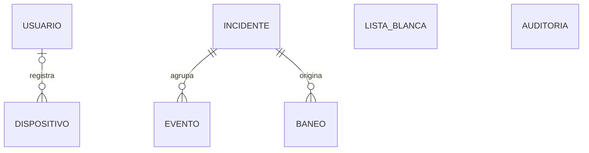

# Modelo de datos — Plataforma de Defensa Web (estado final, Sprint 2)

> **Para qué sirve este documento.** Es el contexto del esquema de `defensa.db` tras ejecutar `alembic upgrade head` (revisión `0003_sprint2_final`). Sirve para el equipo y para pegarlo como contexto en una conversación con una IA. **Si contradice al diagrama de clases, manda este documento**: el diagrama debe ajustarse a él (ver sección 10).
>
> Grupo 13 · Ingeniería de Software II · UAGRM · 19 de septiembre de 2026.
> Verificado con Alembic 1.20 y SQLAlchemy 2.0 sobre SQLite: la migración 0001 reproduce carácter por carácter el esquema de `defensa.db`, y 0002 y 0003 se probaron con datos (subida, bajada y ciclo completo). Las tablas de la sección 4 salen del esquema real, no están escritas a mano.

---

## 1. Resumen

| Aspecto | Definición |
|---|---|
| Motor | SQLite, archivo `defensa.db`, modo WAL y `foreign_keys=ON` (ver sección 9) |
| ORM | SQLModel (SQLAlchemy 2) |
| Migraciones | Alembic, 3 revisiones (sección 2) |
| Tablas | 7: `usuario`, `lista_blanca`, `incidente`, `evento`, `baneo`, `dispositivo`, `auditoria` (55 columnas) |
| Fechas | `DATETIME` en UTC; se convierten a hora local solo al mostrar |
| Borrado | La base no define `ON DELETE`. Los incidentes son permanentes; solo se purgan eventos, por fecha |

## 2. Migraciones

| Revisión | Sprint | Historias | Qué cambia |
|---|---|---|---|
| `0001_base_inicial` | Base | — | Crea las 7 tablas y 5 índices |
| `0002_sprint1_nucleo` | 1 | Pb-5, Pb-6, Pb-7 | `incidente`: `total_eventos`, `informe`, `origen_informe`. `lista_blanca`: `predeterminada`. Índices `ix_evento_incidente_id`, `ix_baneo_incidente_id`, `ix_baneo_estado_expira` y el único parcial `uq_incidente_abierto` |
| `0003_sprint2_final` | 2 | Pb-10, Pb-19, Pb-20 | `incidente`: `severidad_notificada`, `modelo_informe`. `evento`: `user_agent`, `cuerpo_truncado`, `clase_ia`, `confianza_ia` |

- La tabla `dispositivo` (Pb-8 y Pb-9) existe desde la 0001 y no cambia.
- Todas las columnas de 0003 son opcionales: quedan en `NULL` hasta que cada historia se implemente.
- **Supuesto:** Pb-19 y Pb-20 caen en el Sprint 2. Si no es así, esas columnas pasan a una `0004`.
- `0002` cierra los incidentes abiertos duplicados (deja el más reciente) antes de crear el índice único; ese cierre no se revierte al bajar de versión.

## 3. Relaciones



| Relación | Multiplicidad | Nota |
|---|---|---|
| `evento.incidente_id` → `incidente` | Un incidente agrupa 0..* eventos; cada evento pertenece a 1 incidente | Composición: los eventos se purgan a los 30 días, pero no existen sin su incidente |
| `baneo.incidente_id` → `incidente` | Un incidente origina 0..* baneos; cada baneo pertenece a 1 incidente | Obligatoria: ver decisión abierta 1 |
| `dispositivo.usuario_id` → `usuario` | Un usuario registra 0..* dispositivos; cada dispositivo tiene 0..1 usuario | Opcional en la base; la aplicación siempre lo llena |
| `lista_blanca`, `auditoria` | Sin claves foráneas | `auditoria` es un registro de solo agregar: guarda el actor como texto para no depender de ninguna otra tabla. La regla "nunca banear una IP en lista blanca" la aplica el código, no el esquema |

## 4. Tablas

Columna **Desde** = migración que la creó.

### `usuario`

| Columna | Tipo | Nulo | Clave | Desde | Notas |
|---|---|---|---|---|---|
| `id` | INTEGER | no | PK | 0001 |  |
| `nombre` | VARCHAR | no | único | 0001 | Único |
| `hash_contrasena` | VARCHAR | no |  | 0001 | Hash de la contraseña, nunca la contraseña |
| `activo` | BOOLEAN | no |  | 0001 | Se desactiva en vez de borrar |
| `creado_en` | DATETIME | no |  | 0001 |  |

### `lista_blanca`

| Columna | Tipo | Nulo | Clave | Desde | Notas |
|---|---|---|---|---|---|
| `id` | INTEGER | no | PK | 0001 |  |
| `ip_o_red` | VARCHAR | no | único | 0001 | IP o red en notación CIDR; único |
| `descripcion` | VARCHAR | sí |  | 0001 |  |
| `predeterminada` | BOOLEAN (defecto 0) | no |  | 0002 | Loopback, red de administración y gateway: no se pueden quitar |

### `incidente`

| Columna | Tipo | Nulo | Clave | Desde | Notas |
|---|---|---|---|---|---|
| `id` | INTEGER | no | PK | 0001 |  |
| `ip_origen` | VARCHAR | no |  | 0001 | IP del atacante |
| `categoria` | VARCHAR | no |  | 0001 | Categoría de la alerta. Con `ip_origen` forma la clave de correlación |
| `tipo_ataque` | VARCHAR | no |  | 0001 | Ver valores permitidos; lo refina el clasificador |
| `severidad` | INTEGER | no |  | 0001 | 1 baja · 2 media · 3 alta · 4 crítica (mayor = más grave) |
| `estado` | VARCHAR | no |  | 0001 | `abierto` / `cerrado` |
| `inicio` | DATETIME | no |  | 0001 |  |
| `ultima_actividad` | DATETIME | no |  | 0001 | Base del cierre por inactividad (5 min) |
| `total_eventos` | INTEGER (defecto 0) | no |  | 0002 | Contador que sobrevive a la purga de eventos |
| `informe` | TEXT | sí |  | 0002 | Lenguaje natural; se llena después de crear el incidente |
| `origen_informe` | VARCHAR | sí |  | 0002 | `plantilla` / `generado_ia` |
| `severidad_notificada` | INTEGER | sí |  | 0003 | Última severidad enviada por push; `NULL` = ninguna |
| `modelo_informe` | VARCHAR | sí |  | 0003 | Modelo que redactó el informe (OpenRouter en producción, Ollama en laboratorio) |

### `evento`

| Columna | Tipo | Nulo | Clave | Desde | Notas |
|---|---|---|---|---|---|
| `id` | INTEGER | no | PK | 0001 |  |
| `fecha_utc` | DATETIME | no |  | 0001 | UTC; base de la purga a 30 días |
| `ip_origen` | VARCHAR | no |  | 0001 | IP de origen de la petición |
| `sid` | INTEGER | no |  | 0001 | ID de la firma de Suricata |
| `firma` | VARCHAR | no |  | 0001 |  |
| `categoria` | VARCHAR | no |  | 0001 | Categoría de la alerta |
| `severidad_firma` | INTEGER | no |  | 0001 | Valor crudo de Suricata: 1 alta · 2 media · 3 baja (escala inversa a la de `incidente`) |
| `metodo` | VARCHAR | sí |  | 0001 | Opcional: una alerta puede no traer datos HTTP |
| `url` | VARCHAR | sí |  | 0001 | Opcional |
| `incidente_id` | INTEGER | no | FK → incidente | 0001 |  |
| `user_agent` | VARCHAR | sí |  | 0003 | Entrada del clasificador |
| `cuerpo_truncado` | TEXT | sí |  | 0003 | Entrada del clasificador; se trunca en la aplicación (límite por definir) |
| `clase_ia` | VARCHAR | sí |  | 0003 | Salida del clasificador; bajo el umbral de confianza (propuesta 0,6) → `indeterminado` |
| `confianza_ia` | FLOAT | sí |  | 0003 | Salida del clasificador, de 0 a 1 |

### `baneo`

| Columna | Tipo | Nulo | Clave | Desde | Notas |
|---|---|---|---|---|---|
| `id` | INTEGER | no | PK | 0001 |  |
| `ip` | VARCHAR | no |  | 0001 | IP bloqueada en el firewall |
| `inicio` | DATETIME | no |  | 0001 |  |
| `expira` | DATETIME | no |  | 0001 |  |
| `estado` | VARCHAR | no |  | 0001 | `vigente` / `expirado` / `liberado` / `fallido` |
| `nivel_reincidencia` | INTEGER | no |  | 0001 | 0 = primer baneo. Duración = 10 min × 2^nivel, con tope de 24 h |
| `incidente_id` | INTEGER | no | FK → incidente | 0001 | Obligatorio: todo baneo pertenece a un incidente |

### `dispositivo`

| Columna | Tipo | Nulo | Clave | Desde | Notas |
|---|---|---|---|---|---|
| `id` | INTEGER | no | PK | 0001 |  |
| `token_fcm` | VARCHAR | no | único | 0001 | Único. Rota: se actualiza sin duplicar y se elimina si FCM responde `UNREGISTERED` |
| `plataforma` | VARCHAR | no |  | 0001 | `android` / `ios` |
| `alta` | DATETIME | no |  | 0001 |  |
| `actualizado_en` | DATETIME | no |  | 0001 |  |
| `usuario_id` | INTEGER | sí | FK → usuario | 0001 | Opcional en la base; la aplicación siempre lo llena |

### `auditoria`

| Columna | Tipo | Nulo | Clave | Desde | Notas |
|---|---|---|---|---|---|
| `id` | INTEGER | no | PK | 0001 |  |
| `fecha_utc` | DATETIME | no |  | 0001 |  |
| `actor` | VARCHAR | no |  | 0001 | Nombre de usuario, o `sistema` en las acciones automáticas |
| `accion` | VARCHAR | no |  | 0001 | Texto corto (por ejemplo `baneo_automatico`, `baneo_liberado`; sugerencia) |
| `ip_afectada` | VARCHAR | sí |  | 0001 |  |
| `detalle` | VARCHAR | sí |  | 0001 | Contexto libre (por ejemplo el id del baneo afectado) |

## 5. Índices

| Índice | Tabla | Columnas | Para qué (probado con `EXPLAIN QUERY PLAN`) | Desde |
|---|---|---|---|---|
| `ix_incidente_ip_origen` | incidente | `ip_origen` | Buscar incidentes de una IP | 0001 |
| `ix_incidente_ultima_actividad` | incidente | `ultima_actividad` | Cierre por inactividad (5 min) | 0001 |
| `ix_evento_fecha_utc` | evento | `fecha_utc` | Purga de eventos con más de 30 días | 0001 |
| `ix_evento_ip_origen` | evento | `ip_origen` | Eventos de una IP | 0001 |
| `ix_baneo_ip` | baneo | `ip` | Baneos de una IP (reincidencia) | 0001 |
| `ix_evento_incidente_id` | evento | `incidente_id` | Eventos de un incidente (SQLite no indexa las claves foráneas) | 0002 |
| `ix_baneo_incidente_id` | baneo | `incidente_id` | Baneos de un incidente | 0002 |
| `ix_baneo_estado_expira` | baneo | `estado`, `expira` | Conciliador: baneos vigentes ya vencidos | 0002 |
| `uq_incidente_abierto` | incidente | `ip_origen`, `categoria` **donde** `estado = 'abierto'` | **Único parcial**: un solo incidente abierto por IP y categoría, aunque sqlmap lance ráfagas | 0002 |

Obtener o crear el incidente abierto sin condiciones de carrera (sintaxis probada en SQLite):

```sql
INSERT INTO incidente (ip_origen, categoria, tipo_ataque, severidad, estado, inicio, ultima_actividad, total_eventos)
VALUES (:ip, :cat, :tipo, :sev, 'abierto', :ahora, :ahora, 0)
ON CONFLICT (ip_origen, categoria) WHERE estado = 'abierto' DO NOTHING;
-- después: SELECT ... WHERE ip_origen = :ip AND categoria = :cat AND estado = 'abierto'
```

## 6. Valores permitidos

La base guarda texto sin restricciones `CHECK`; los valores los valida la aplicación con `Enum` de Python. Se guardan en `snake_case`.

| Campo | Valores |
|---|---|
| `incidente.estado` | `abierto`, `cerrado` |
| `baneo.estado` | `vigente`, `expirado`, `liberado`, `fallido` |
| `incidente.tipo_ataque` | `sqli`, `xss`, `traversal`, `escaneo`, `sondeo_archivos`, `fuerza_bruta`, `indeterminado` |
| `evento.clase_ia` | `benigno`, `sqli`, `xss`, `traversal`, `escaneo`, `fuerza_bruta`, `indeterminado` (sin `sondeo_archivos`: decisión abierta 3) |
| `incidente.origen_informe` | `plantilla`, `generado_ia` |
| `dispositivo.plataforma` | `android`, `ios` |
| `auditoria.actor` | Nombre de usuario, o `sistema` |

**Dos escalas de severidad, a propósito.** `evento.severidad_firma` guarda el valor crudo de Suricata (1 = alta, 2 = media, 3 = baja). `incidente.severidad` y `incidente.severidad_notificada` usan una escala donde **mayor es más grave**: 1 baja, 2 media, 3 alta, 4 crítica. El correlador convierte al ingresar (firma 1 → 3, 2 → 2, 3 → 1). **Crítica** = severidad alta + reincidente. Usa un `IntEnum` para no mezclar las escalas.

## 7. Reglas que dependen de los datos

Los valores numéricos son iniciales y se calibran en las pruebas.

| Regla | Cómo se apoya en el esquema |
|---|---|
| Correlación | Misma IP + misma `categoria` dentro de 5 minutos; garantizada por `uq_incidente_abierto` |
| Cierre de incidente | Sin baneo `vigente` y sin eventos nuevos en 5 minutos, según `ultima_actividad` |
| Umbral de baneo | 5 eventos de severidad media o mayor, misma IP, en 60 s; se consulta `lista_blanca` antes |
| Duración del baneo | 10 min × 2^`nivel_reincidencia`, con tope de 24 h |
| Severidad final | La mayor entre la de la firma y la del clasificador |
| Notificación push | Solo si `severidad >= 3` y (`severidad_notificada IS NULL` o `severidad > severidad_notificada`); luego se actualiza `severidad_notificada` |
| Informe | Se crea después del incidente, sin bloquear la lectura de eventos. Si la IA tarda más de 20 s o su salida no tiene las secciones esperadas, `origen_informe = 'plantilla'` |
| Conciliador | Al arrancar, los baneos `vigente` con `expira` vencida pasan a `expirado`, y se contrasta con Fail2ban |
| Retención | Incidentes permanentes; eventos, 30 días (los borra una tarea por `fecha_utc`). `total_eventos` conserva la cuenta |
| Auditoría | Cada acción que modifique el firewall, con `actor`, `fecha_utc` e `ip_afectada` |

## 8. Lo que NO está en la base

| Elemento | Dónde vive |
|---|---|
| Aplicación protegida | Configuración (una sola aplicación, fijada al desplegar). No hay tabla |
| Umbrales, rutas y modo real o simulado | Configuración del servicio |
| Usuario administrador | Se siembra al arrancar desde una variable de entorno; no va en migraciones porque lleva secretos |
| Entradas predeterminadas de `lista_blanca` | Las inserta la aplicación al arrancar con `predeterminada = 1`, porque dependen de la red de cada máquina |
| Categoría OWASP | Se deriva de `tipo_ataque` con una tabla configurable; no hay columna |
| Notificaciones enviadas | Solo el rastro `severidad_notificada`; no hay tabla `notificacion` |
| `eve.json`, `access.log` | Archivos de entrada; `evento` es la copia que se conserva 30 días |
| Modelo del clasificador, clave de Firebase, clave de OpenRouter | Archivos y variables de entorno: `clasificador.joblib`, `firebase-service-account.json`, `defensa.env` |

## 9. Configuración de SQLite en la aplicación

`journal_mode=WAL` se guarda una vez en el archivo, pero `foreign_keys` es por conexión: sin activarlo, SQLite no aplica las claves foráneas. El archivo entregado estaba en `journal_mode = delete`.

```python
from sqlalchemy import event

@event.listens_for(engine, "connect")
def _pragmas(dbapi_conn, _):
    cur = dbapi_conn.cursor()
    cur.execute("PRAGMA journal_mode=WAL")
    cur.execute("PRAGMA foreign_keys=ON")
    cur.execute("PRAGMA busy_timeout=5000")   # espera en vez de fallar si hay otra escritura
    cur.close()
```

En `env.py` de Alembic usa `render_as_batch=True`: SQLite no soporta la mayoría de los `ALTER`.

## 10. Diferencias con el diagrama de clases (para sincronizarlo)

| Clase | Diagrama actual | Base real |
|---|---|---|
| `Incidente` | Tiene `categoriaOwasp`; `severidad` enumeración | Sin `categoriaOwasp`; **`categoria`** obligatoria; `severidad` entero (1 a 4) |
| `Evento` | `metodo` y `url` obligatorios | Opcionales |
| `Auditoria` | Asociada a `Usuario` y a `Baneo` | Sin asociaciones; `actor: String`, `detalle: String [0..1]` |
| `Usuario` | 3 atributos | Además `activo` y `creadoEn` |
| `Baneo` | `incidente` opcional; tiene `motivo` | `incidente` obligatorio; sin `motivo` |
| `Dispositivo` | `usuario` obligatorio (1) | `usuario` opcional (0..1) |
| `AplicacionProtegida` | Clase `«configuración»` | Sin tabla |

## 11. Decisiones abiertas

1. **Fuerza bruta.** Fail2ban banea leyendo `access.log`, sin pasar por Suricata, pero `baneo.incidente_id` es obligatorio. El servicio debe enterarse del baneo y crear un incidente `fuerza_bruta`. Falta definir cómo lo hace.
2. **Sprint de Pb-19 y Pb-20.** Si no caen en el Sprint 2, mover esas columnas a una `0004`.
3. **Clase `sondeo_archivos`.** `incidente.tipo_ataque` la admite, pero el clasificador no la tiene. Se agrega al clasificador o se mapea a `escaneo`.
4. **`dispositivo.usuario_id` opcional.** El código siempre lo llena. Hacerlo obligatorio exige reconstruir la tabla con `batch_alter_table`; hoy no compensa.

## 12. Comandos

```bash
alembic current                # revisión actual de defensa.db
alembic upgrade head           # aplica 0002 y 0003 sobre una base en 0001
alembic downgrade -1           # revierte la última migración
alembic revision --autogenerate -m "..."   # solo si los modelos SQLModel ya coinciden con esta base
```

Mantén los modelos SQLModel iguales a este esquema: si difieren, `--autogenerate` propondrá borrar o modificar columnas.

## 13. Estado de implementación real (código, auditoría 2026-09-19)

El código de `servicio/app/dominio/modelos.py` está solo dos migraciones adentro (`0001_base_inicial`, `0002_integracion_real_movil_ia`; no existe aún `0003`), y difiere de este documento en varios puntos. Se deja constancia aquí para no perder de vista qué falta implementar; **no se tocó código al escribir esta sección, solo se documenta la brecha**:

1. **Escala de `incidente.severidad`:** el código la copia/propaga directamente desde `evento.severidad_firma` (`min()` en el correlador, mismo sentido 1=alta) — **no aplica la inversión** descrita en la sección 6, y el rango es `1-3`, sin nivel 4 (`crítica`). La sección 6 documenta el diseño objetivo (escala invertida 1 baja→4 crítica); implementarlo queda pendiente.
2. **`evento.clase_ia` / `evento.confianza_ia`:** no existen en la tabla `evento`. El resultado del clasificador se guarda hoy en `incidente.confianza_clasificador` (agregada en `0002`). Decidir si se migra a `evento` (como aquí se especifica) o se deja a nivel de incidente.
3. **`lista_blanca`:** la tabla existe pero ningún componente la lee ni la escribe; no tiene entradas predeterminadas sembradas al arrancar. La exclusión real de IPs usa `Ajustes.lista_blanca` (variable de entorno), no esta tabla.
4. **`incidente.categoria_owasp`:** el código sí la almacena como columna (contra lo dicho en la sección 8, que la marca como derivada y no persistida). Se mantiene así por ahora; si se decide derivarla en vez de almacenarla, es un cambio de código, no solo de documento.
5. **Columnas de `0003` (`total_eventos`, `severidad_notificada`, `modelo_informe`, `user_agent`, `cuerpo_truncado`):** no implementadas todavía; corresponden a Sprint 2 y no son necesarias para el alcance actual.
6. **Componente `conciliador`: implementado.** Al arrancar reconcilia baneos vigentes en BD con
   el estado real del firewall, expira los vencidos, restaura ausentes y libera huérfanos del jail
   dedicado. Usa la capa explícita `Repositorio` y tiene pruebas de integración.
7. **`GET /api/eventos` (SSE), criterio de aceptación de Pb-10:** no implementado. Hoy la notificación de incidentes depende solo de FCM.
8. **Generación de informes:** usa `GeneradorOpenRouter` (IA en la nube) como generador principal, con `GeneradorPlantilla` como respaldo — ver la nota de decisión de equipo en el documento base sobre el Requisito técnico 1.

Estos ocho puntos son la lista de trabajo pendiente para que el código alcance lo que este documento especifica; no bloquean el inicio del Sprint 1 (ver checklist de cimientos), pero sí deben cerrarse antes de dar por completo el incremento.
