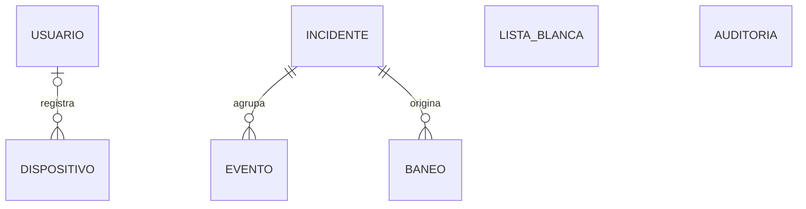

# Modelo de datos — estado implementado

> Estado verificado el 20 de septiembre de 2026 contra las migraciones de Alembic y los modelos
> SQLModel del repositorio. Este documento describe lo que crea
> `python -m alembic -c backend/alembic.ini upgrade head`; las funciones previstas para Sprint 2
> que todavía no existen se enumeran al final y no se presentan como implementadas.

## 1. Resumen

| Aspecto | Estado vigente |
|---|---|
| Motor | SQLite, archivo configurable mediante `DEFENSA_DATABASE_URL` |
| ORM | SQLModel sobre SQLAlchemy 2 |
| Migraciones | Alembic, seis revisiones; revisión cabeza: `0006_modelo_informe` |
| Tablas de aplicación | 7: `usuario`, `incidente`, `evento`, `baneo`, `lista_blanca`, `dispositivo`, `auditoria` |
| Columnas de aplicación | 59 |
| Tabla técnica | `alembic_version` |
| Fechas | `DATETIME` UTC sin información de zona; se convierten solo al presentar |
| Integridad referencial | `foreign_keys=ON` en las conexiones creadas por la aplicación |
| Concurrencia | WAL, `synchronous=NORMAL` y `busy_timeout=5000` en la aplicación |

La fuente de verdad para una base desplegada son las migraciones de
`backend/alembic/versions/`. Los modelos de `backend/app/dominio/modelos.py` deben permanecer
alineados con ellas.

## 2. Migraciones vigentes

| Revisión | Cambio |
|---|---|
| `0001_base_inicial` | Crea las siete tablas, relaciones e índices iniciales. |
| `0002_integracion_real_movil_ia` | Agrega a `incidente` la confianza del clasificador, categoría OWASP, informe y origen del informe; agrega `dispositivo.activo`. |
| `0003_accion_evento` | Agrega `evento.accion`, con valor inicial `alerta`. |
| `0004_entradas_clasificador` | Agrega al evento URI decodificada, parámetros, fragmento de cuerpo, agente de usuario, clase y confianza de IA. |
| `0005_notificacion_incidente` | Agrega `incidente.severidad_notificada` para no repetir una alerta push. |
| `0006_modelo_informe` | Agrega `incidente.modelo_informe` para identificar el modelo local que redactó la ficha. |

El 20 de septiembre de 2026 se ejecutó `upgrade head` sobre las dos bases de desarrollo
existentes (`datos/defensa.db` y `backend/datos/defensa.db`) y ambas quedaron en
`0006_modelo_informe`. Los archivos SQLite son datos de ejecución y no se versionan; una
instalación nueva o una copia restaurada debe ejecutar siempre `upgrade head` antes de arrancar.

Comandos desde la raíz del repositorio:

```bash
python -m alembic -c backend/alembic.ini current
python -m alembic -c backend/alembic.ini upgrade head
python -m alembic -c backend/alembic.ini downgrade -1
```

## 3. Relaciones



| Relación | Multiplicidad implementada | Clave |
|---|---|---|
| Incidente–Evento | Un incidente agrupa 0..* eventos; cada evento pertenece a un incidente | `evento.incidente_id` no nula |
| Incidente–Baneo | Un incidente origina 0..* baneos; cada baneo pertenece a un incidente | `baneo.incidente_id` no nula |
| Usuario–Dispositivo | Un usuario puede registrar 0..* dispositivos; un dispositivo puede no tener usuario | `dispositivo.usuario_id` opcional |
| Lista blanca y Auditoría | No tienen claves foráneas | Reglas aplicadas por la aplicación |

Las migraciones no declaran `ON DELETE CASCADE`. El código debe controlar cualquier eliminación.

## 4. Tablas

La columna **Desde** identifica la migración que incorporó cada campo.

### `usuario`

| Columna | Tipo | Nulo | Clave | Desde | Uso |
|---|---|---:|---|---|---|
| `id` | INTEGER | no | PK | 0001 | Identificador |
| `nombre` | VARCHAR | no | único | 0001 | Inicio de sesión |
| `hash_contrasena` | VARCHAR | no |  | 0001 | Contraseña con hash |
| `activo` | BOOLEAN | no |  | 0001 | Desactivación lógica |
| `creado_en` | DATETIME | no |  | 0001 | Alta en UTC |

### `incidente`

| Columna | Tipo | Nulo | Clave | Desde | Uso |
|---|---|---:|---|---|---|
| `id` | INTEGER | no | PK | 0001 | Identificador |
| `ip_origen` | VARCHAR | no | índice | 0001 | Origen correlacionado |
| `categoria` | VARCHAR | no |  | 0001 | Categoría de la firma |
| `tipo_ataque` | VARCHAR | no |  | 0001 | Tipo refinado por el clasificador |
| `severidad` | INTEGER | no |  | 0001 | 1 baja, 2 media, 3 alta |
| `estado` | VARCHAR | no |  | 0001 | `abierto` o `cerrado` |
| `inicio` | DATETIME | no |  | 0001 | Primer evento |
| `ultima_actividad` | DATETIME | no | índice | 0001 | Último evento |
| `confianza_clasificador` | FLOAT | sí |  | 0002 | Confianza más reciente a nivel de incidente |
| `categoria_owasp` | VARCHAR | sí |  | 0002 | Categoría calculada y persistida |
| `informe` | VARCHAR | sí |  | 0002 | Informe en lenguaje natural |
| `origen_informe` | VARCHAR | sí |  | 0002 | `plantilla` o `generado_ia` |
| `severidad_notificada` | INTEGER | sí |  | 0005 | Última severidad enviada por FCM |
| `modelo_informe` | VARCHAR | sí |  | 0006 | Modelo local que generó la ficha; nulo para plantilla |

No existe actualmente `total_eventos`.

### `evento`

| Columna | Tipo | Nulo | Clave | Desde | Uso |
|---|---|---:|---|---|---|
| `id` | INTEGER | no | PK | 0001 | Identificador |
| `fecha_utc` | DATETIME | no | índice | 0001 | Momento del evento |
| `ip_origen` | VARCHAR | no | índice | 0001 | Dirección observada |
| `sid` | INTEGER | no |  | 0001 | Identificador de firma Suricata |
| `firma` | VARCHAR | no |  | 0001 | Texto de la firma |
| `categoria` | VARCHAR | no |  | 0001 | Categoría de la alerta |
| `severidad_firma` | INTEGER | no |  | 0001 | Escala Suricata: 1 alta, 2 media, 3 baja |
| `metodo` | VARCHAR | sí |  | 0001 | Método HTTP |
| `url` | VARCHAR | sí |  | 0001 | URL original disponible |
| `incidente_id` | INTEGER | no | FK | 0001 | Incidente al que pertenece |
| `accion` | VARCHAR | no |  | 0003 | `alerta` o `descarte` |
| `uri_decodificada` | VARCHAR | sí |  | 0004 | Entrada del clasificador |
| `parametros` | VARCHAR | sí |  | 0004 | Entrada del clasificador |
| `cuerpo_fragmento` | TEXT | sí |  | 0004 | Fragmento limitado a 2048 caracteres |
| `user_agent` | VARCHAR | sí |  | 0004 | Entrada del clasificador |
| `clase_ia` | VARCHAR | sí |  | 0004 | Clase predicha |
| `confianza_ia` | FLOAT | sí |  | 0004 | Confianza entre 0 y 1 |

El nombre real es `cuerpo_fragmento`, no `cuerpo_truncado`.

### `baneo`

| Columna | Tipo | Nulo | Clave | Desde | Uso |
|---|---|---:|---|---|---|
| `id` | INTEGER | no | PK | 0001 | Identificador |
| `ip` | VARCHAR | no | índice | 0001 | Dirección bloqueada |
| `inicio` | DATETIME | no |  | 0001 | Inicio en UTC |
| `expira` | DATETIME | no |  | 0001 | Vencimiento |
| `estado` | VARCHAR | no |  | 0001 | Estado operativo |
| `nivel_reincidencia` | INTEGER | no |  | 0001 | Existe en el esquema; todavía no modifica la duración |
| `incidente_id` | INTEGER | no | FK | 0001 | Incidente que originó el bloqueo |

El índice único parcial `uq_baneo_ip_vigente` garantiza como máximo un baneo con estado
`vigente` por IP.

### `lista_blanca`

| Columna | Tipo | Nulo | Clave | Desde |
|---|---|---:|---|---|
| `id` | INTEGER | no | PK | 0001 |
| `ip_o_red` | VARCHAR | no | único | 0001 |
| `descripcion` | VARCHAR | sí |  | 0001 |

La tabla existe, pero la política actual consulta `DEFENSA_LISTA_BLANCA`; todavía no lee esta
tabla. No existe la columna `predeterminada`.

### `dispositivo`

| Columna | Tipo | Nulo | Clave | Desde | Uso |
|---|---|---:|---|---|---|
| `id` | INTEGER | no | PK | 0001 | Identificador |
| `token_fcm` | VARCHAR | no | único | 0001 | Destino de notificación |
| `plataforma` | VARCHAR | no |  | 0001 | `android` o `ios` |
| `alta` | DATETIME | no |  | 0001 | Registro inicial |
| `actualizado_en` | DATETIME | no |  | 0001 | Rotación/actualización |
| `usuario_id` | INTEGER | sí | FK | 0001 | Usuario propietario |
| `activo` | BOOLEAN | no |  | 0002 | Participa en envíos FCM |

### `auditoria`

| Columna | Tipo | Nulo | Clave | Desde |
|---|---|---:|---|---|
| `id` | INTEGER | no | PK | 0001 |
| `fecha_utc` | DATETIME | no |  | 0001 |
| `actor` | VARCHAR | no |  | 0001 |
| `accion` | VARCHAR | no |  | 0001 |
| `ip_afectada` | VARCHAR | sí |  | 0001 |
| `detalle` | VARCHAR | sí |  | 0001 |

Es un registro de solo agregar y conserva el actor como texto; no tiene relación con
`usuario` ni `baneo`.

## 5. Índices implementados

| Índice | Tabla | Columnas | Propósito |
|---|---|---|---|
| `ix_incidente_ip_origen` | incidente | `ip_origen` | Consulta por origen |
| `ix_incidente_ultima_actividad` | incidente | `ultima_actividad` | Cierre por inactividad |
| `ix_evento_fecha_utc` | evento | `fecha_utc` | Consulta temporal |
| `ix_evento_ip_origen` | evento | `ip_origen` | Conteo por origen |
| `ix_baneo_ip` | baneo | `ip` | Consulta y reincidencia |
| `uq_baneo_ip_vigente` | baneo | `ip`, si `estado = 'vigente'` | Evita dos baneos vigentes de una IP |

No están implementados `uq_incidente_abierto`, `ix_evento_incidente_id`,
`ix_baneo_incidente_id` ni `ix_baneo_estado_expira`.

## 6. Reglas implementadas que dependen de datos

| Regla | Comportamiento vigente |
|---|---|
| Correlación | Reutiliza el incidente abierto más reciente con la misma IP y categoría dentro de la ventana configurada, por defecto 300 s. |
| Severidad | Convierte Suricata con `4 - severidad_firma`; el clasificador puede elevarla. El rango actual es 1 a 3. |
| Cierre | Cierra incidentes inactivos fuera de la ventana si no tienen un baneo vigente sin vencer. |
| Umbral de baneo | Por defecto, cinco eventos de la misma IP con `severidad_firma <= 2` dentro de 60 s. |
| Lista blanca | Lee redes desde configuración; no consulta la tabla `lista_blanca`. |
| Duración | Usa una duración fija configurable, por defecto 600 s. El bloqueo progresivo aún no está implementado. |
| Reintento | Un baneo fallido se reutiliza y vuelve a intentarse; cada resultado se audita. |
| Informe | Persiste categoría OWASP, texto y origen; usa OpenRouter cuando está configurado y plantilla como respaldo. |
| Notificación | Envía si la severidad es al menos 3 y todavía no se notificó ese nivel; registra `severidad_notificada`. |
| Conciliación | Compara baneos `vigente` o `fallido` con Fail2ban, restaura, expira o libera huérfanos. |

No existe actualmente una tarea de purga a 30 días ni un contador persistente de eventos.

## 7. Configuración SQLite

La aplicación configura cada conexión mediante eventos SQLAlchemy:

```sql
PRAGMA journal_mode=WAL;
PRAGMA synchronous=NORMAL;
PRAGMA foreign_keys=ON;
PRAGMA busy_timeout=5000;
```

Alembic crea y migra el esquema. Cualquier cambio estructural debe agregarse como una nueva
revisión; no se debe editar una revisión ya aplicada en entornos compartidos.

## 8. Brechas conocidas para el Sprint 2

1. La administración persistente de la lista blanca requiere conectar la política con
   `lista_blanca` o decidir formalmente conservar solo la configuración.
2. El bloqueo progresivo debe usar y actualizar `nivel_reincidencia`; hoy la duración es fija.
3. La retención de eventos y un posible `total_eventos` requieren diseño y migración.
4. La base no impone un único incidente abierto por IP y categoría. Si se necesita esa garantía
   concurrente, debe agregarse una migración y una estrategia de inserción compatible.
5. Los filtros de historial pueden requerir índices adicionales, especialmente sobre las claves
   foráneas y sobre estado/fecha.
6. `categoria_owasp` se almacena actualmente. Cualquier decisión de derivarla en lectura implica
   migración y cambio de código.
7. `dispositivo.usuario_id` sigue siendo opcional en el esquema, aunque el flujo normal lo llena.

Estas brechas son trabajo futuro; no describen fallos de migración en la revisión
`0006_modelo_informe`.
